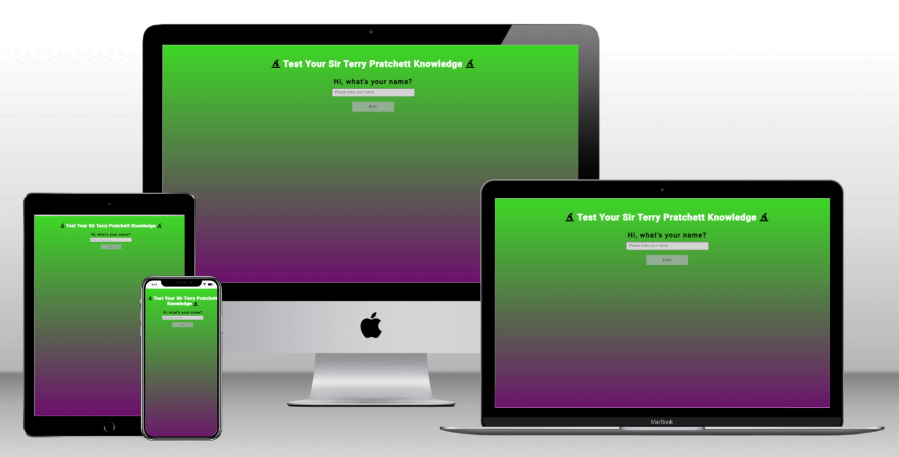
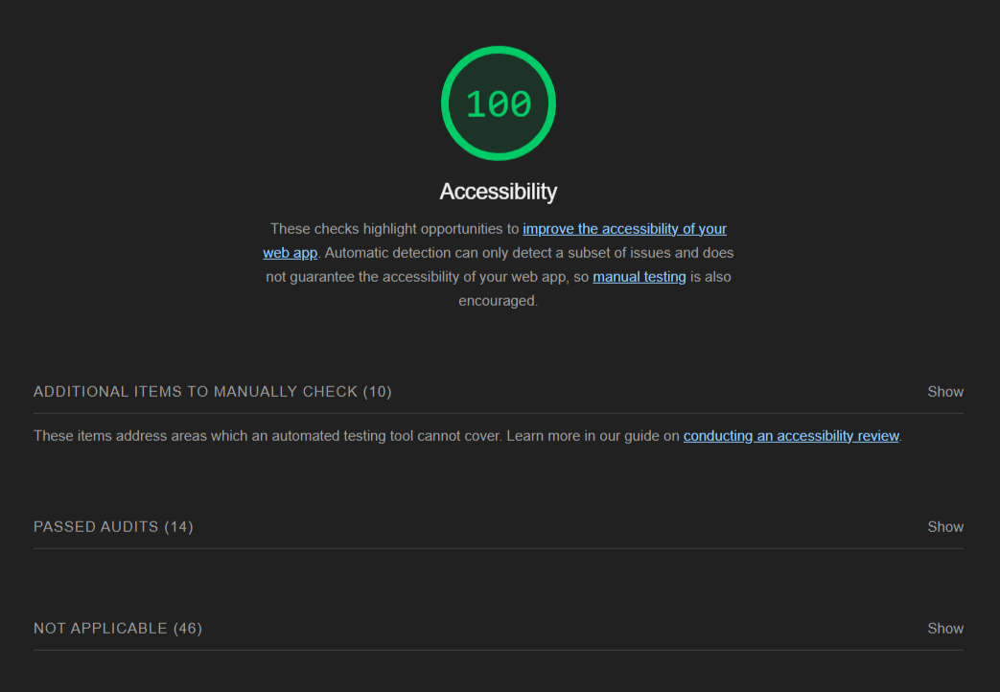

# Test Your Sir Terry Pratchett Knowledge

## Purpose

This is a small website with a limited question base, however I intend to expand it as I learn about API's so I can include greater pools of questions.

The purpose of this website is to have some fun while testing your STP knowledge, using a randomiser to pick x-questions from a pool of y-questions.  At the same time not repeating any questions from the question pool.

## UX

The interface for this is a very simple multi-choice option, one answer is correct, the next button is unlocked by selecting an answer.  If the answer is correct the button will change colour to green, if the answer is incorrect the button will change to red and the correct answer will be highlighted.  You can not change your choice after selecting, as the click locks the answer and releases the 'Next' button.

## Design

For this project, I made the decision to not use any images, I made this decision based on known copyright issues with images, the estate is, understandably, quite strict about this.

The colour choices made are loosely based on Rincwind and some of his comments, but mostly based on personal choice, and trying to minimise optical issues.

## Features

As a multi-choice question based quiz the features of this site are quite minimal.  I have done this on purpose, I wanted to ensure I had a workable site that functioned the way I needed it to on the due date.  As such it is a very simple interface that allows you to enter your name, and asks 15 random questions from the available list, the questions asked are not repeated within a round, and are randomised within the list.

# Technologies

This is a list of technologies used during the construction and testing of the site:
***
* HTML to accomplish the structure of the website.
* CSS to style the website.
* Javascript for the functionality of the website.
* [Gitpod](https://gitpod.io/workspaces) IDE to develop the website.
* [Github](https://github.com/Swewi) To host the source code and GitHub Pages to deploy and host the live site.
* Git to provide version control (to commit and push code to the repository).
* [FontAwesome](https://fontawesome.com/) Version: 6.5.1 Icons.
* [Goggle Fonts](https://fonts.google.com/) For website fonts.
* [Google Dev Tools](https://developer.chrome.com/docs/devtools/) For page inspection and checking website.
* [Favicon](https://favicon.io/) To create favicon for the website.
* [TechSini](https://techsini.com/multi-mockup/) To create mockup image for README.
* [TinyJPG](https://tinyjpg.com/) To compress images for README.
* Google Chrome's [Lighthouse](https://developer.chrome.com/docs/lighthouse/overview/) to check accessibility.
* [NVDA](https://www.nvaccess.org/) Used to test screen reader.
* [Colorfilter](https://www.toptal.com/designers/colorfilter/) to check website for colour-blind accessibility.
* [W3C HTML Markup Validator](https://validator.w3.org/) to check HTML code.
* [W3C Jigsaw CSS Validator](https://jigsaw.w3.org/css-validator/) to check CSS code.
* Code Institute's Gitpod Template to generate the workspace for the project.

# Testing

## Accessibility
I have run tests checking accessibility of the site using:
***
* Screen readers - the site was readable.
* Colour blind check - the site looked good, was readable.
* Vision Imparied - the use of alt-tags and aria-labels to throughout.

## Code
I have checked the HTML using W3C HTML validator - There were no issues.

I have checked the CSS using W3C CSS validator - There were no issues.

I have checked the Javascript using the console within dev tools - There were some small bugs, all of them have been fixed.

I have tried to ensure regular commits occured and that things have been commented correctly.

## Browser testing
Google Chrome - Works well, looks good, can't find any issues.

Edge - Works well, looks good, can't find any issues.

Firefox - Works well, looks good, can't find any issues.

Opera GX - Works well, looks good, can't find any issues.

I haven't been able to check Safari.

need to look at features add game play stuff...