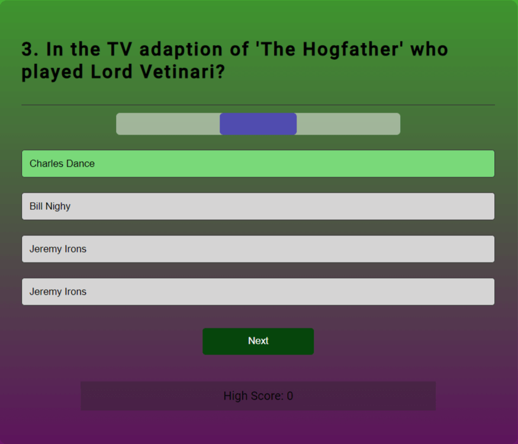

# Test Your Sir Terry Pratchett Knowledge

### [Live Website](https://swewi.github.io/TestingSTPknowledge/)

## Purpose

The purpose of this website is to have some fun while testing your STP knowledge, using a randomiser to pick x-questions from the pool of questions, while also not repeating any questions from the question pool.

## UX
### Entry page

| Entry Page| Difficulty Selection|
|:-:|:-:|

The entry page prompts you to enter a username - this is then used later on.  
It also asks you to pick a difficulty level, this dictates the amount of time you have to answer - it will default to easy if nothing is selected.

### Play field

Once playing you will be confronted with a multi-choice quiz, each question has four options, one is correct.

| Correct answer and plenty of time| Wrong answer and running out of time|
|:-:|:-:|

In these two images you can see the play field with the countdown timer at the top showing different colours, the colours reflect how long through the timer you are for that question.  You can also see the colour of both the right and wrong answers, as well how the question displays the right answer if you answer incorrectly.

| Correct Answer but nearly out of time| Ran out of time to answer, correct answer displayed|
|:-:|:-:|

In these two images you can see the play field with the countdown timer showing red.  The second image has the right answer displayed but the timer has run out.

### End screen

When you have finished the quiz you will see one of the following screen depending on how well you did.

| Zero Score|<Lower or matched a previous highscore| New highscore|
|:-:|:-:|:-:|

## Design

For this project, I made the decision to not use any images, I made this decision based on known copyright issues with images, the estate is, understandably, quite strict about this.

The colour choices made are loosely based on Rincewind and some of his comments, but mostly based on personal choice, and trying to minimise optical issues.

## Features

As a multi-choice question based quiz the features of this site are quite minimal.  I have done this on purpose, I wanted to ensure I had a workable site that functioned the way I needed it to on the due date.  As such it is a very simple interface that allows you to enter your name, and asks 15 random questions from the available list, the questions asked are not repeated within a round, and are randomised within the list.

I have made the buttons so that once an answer is selected, or the timer runs out, all other options are locked AND the correct answer is displayed if you answered incorrectly or ran out of time.

A countdown timer is displayed on the play field, different colours show how close to running out of time you are for each question, the time per question is regulated by your difficulty selection at the begining.

## Future Features

Speaking with some users - changing the difficulty selector to change the question base and keep the timer constant.

Expanding the question base by using an external database and linking it with an API.

# Technologies

This is a list of technologies used during the construction and testing of the site:
***
* HTML to accomplish the structure of the website.
* CSS to style the website.
* Javascript for the functionality of the website.
* [Gitpod](https://gitpod.io/workspaces) IDE to develop the website.
* [Github](https://github.com/Swewi) To host the source code and GitHub Pages to deploy and host the live site.
* Git to provide version control (to commit and push code to the repository).
* [FontAwesome](https://fontawesome.com/) Version: 6.5.1 Icons.
* [Goggle Fonts](https://fonts.google.com/) For website fonts.
* [Google Dev Tools](https://developer.chrome.com/docs/devtools/) For page inspection and checking website.
* [Favicon](https://favicon.io/) To create favicon for the website.
* [TechSini](https://techsini.com/multi-mockup/) To create mockup image for README.
* [TinyJPG](https://tinyjpg.com/) To compress images for README.
* Google Chrome's [Lighthouse](https://developer.chrome.com/docs/lighthouse/overview/) to check accessibility.
* [NVDA](https://www.nvaccess.org/) Used to test screen reader.
* [Colorfilter](https://www.toptal.com/designers/colorfilter/) to check website for colour-blind accessibility.
* [W3C HTML Markup Validator](https://validator.w3.org/) to check HTML code.
* [W3C Jigsaw CSS Validator](https://jigsaw.w3.org/css-validator/) to check CSS code.
* Code Institute's Gitpod Template to generate the workspace for the project.
* Stack Overflow to find out more about markdown and image displaying.
* [freeCodeCamp](https://www.freecodecamp.org/news/how-to-shuffle-an-array-of-items-using-javascript-or-typescript/) For the shuffle function
* [DEV](https://dev.to/codebubb/how-to-shuffle-an-array-in-javascript-2ikj) Same function different source

# Testing

## Accessibility
I have run tests checking accessibility of the site using:
***
* Screen readers - the site was readable.
* Colour blind check - the site looked good, was readable.
* Vision Imparied - the use of alt-tags and aria-labels to throughout.

## Code and Validation
I have checked the HTML using W3C HTML validator - There were no issues.

I have checked the CSS using W3C CSS validator - There were no issues.

I have checked the Javascript using the console within dev tools - There were some small bugs, all of them have been fixed.

I have tried to ensure regular commits occured and that things have been commented correctly.

In order to maintain readability I have separated the questions from the base logic, this helps to easily check for errors and spelling mistakes.

I have left the built in alert() currently, as I build this out as a version 2 I will make the username alert much better.

## Lighthouse Output

This is the Lighthouse output for the desktop site.

     

This is the Lighthouse output for the mobil site.

As you can see this site is currently showing 100% accessabilty for both Mobile and Desktop.

## Browser testing

Google Chrome - Works well, looks good, can't find any issues.

Edge - Works well, looks good, can't find any issues.

Firefox - Works well, looks good, can't find any issues.

Opera GX - Works well, looks good, can't find any issues.

# Deployment
## Cloning the Repository

* On Github navigate to the repository `TestingSTPknowledge`
* Click `Code` drop down menu - a green button shown right above the file list.
* `Copy` the URL of the repository using "HTTPS", "SSH" or "Github CLI".
* Open Git Bash.
* Change the current working directory to the location where you want the cloned directory.
* `Type "git clone"`, and then paste the URL copied earlier.
* Press `enter` to create local clone. A clone of the repository will now be created.

* For more details on how to clone the repository in order to create a copy for own use refer to the site:
[Cloning a Repository](https://docs.github.com/en/repositories/creating-and-managing-repositories/cloning-a-repository)

## Forking a Repository

* On Github navigate to the repository `TestingSTPknowledge`
* Click `Fork` located towards top right corner on the GitHub page.
* Select "owner" for the forked repository from the dropdown menu under `owner`.
* It will create forked repo under the same name as original by default. But you can type a name in `Repository name` or add a description in `Description box`.
* Click on `Create fork`. A forked repo is created.

###### Important Information about forking a repository
* Forking allows you to make any changes without affecting original project. You can send the the suggestions by submitting a pull request. Then the Project Owner can review the pull request before accepting the suggestions and merging them.
* When you have fork to a repository, you don't have access to files locally on your device, for getting access you will need to clone the forked repository.
* For more details on how to fork the repo, in order to for example suggest any changes to the project you can:
[Forking a Repository](https://docs.github.com/en/get-started/quickstart/fork-a-repo)

## Deploying

This project was deployed to GitHub pages. The steps to deploy are as follows:

* Log into GitHub.
* Select `TestingSTPknowledg` from the list of repositories.
* Select `Settings` From the Repositories sub-headings.
* In the left side menu select `Pages` from `Code and automation` section.
* Under the `Source` heading in the dropdown menu select `main`.
* A second drop-down menu should remain with the default value `/(root)`.
* Press `Save`.
* A message that the website is ready to be deployed will appear, refresh the page and the link to the deployed site will be available in a green sub-section on the top of the page.
* Click on the link to go to the live deployed page.

[Link to live website](https://swewi.github.io/TestingSTPknowledge/)

# Credits

## Inspiration
***
* My mentor Ronan, plenty of help where needed, specifically around basic structure, and project scope.
* Code Institute, for The Love Math example.
* Great Stack YouTube channel, How To Make Quiz App Using JavaScript.